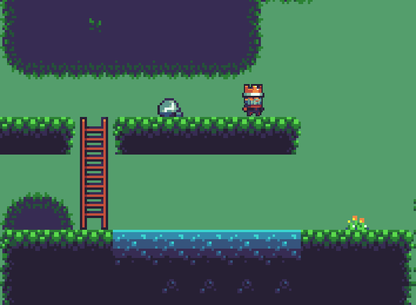
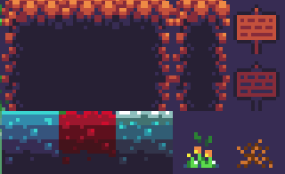

# 2D Platformer Game

A simple 2D game created with java and [Processing](https://www.processing.org) library.

It's my first project and game created using Java.

**I also included JAR file to play it without needing to install anything (only to have Java)**

## Gameplay

1. Controls are very simple:
    1. W - jump/climb up
    2. S - climb down
    3. A - go left
    4. D - go right
2. Press E to open/close editor menu

    1. While the editor is opened, you can choose a tile you want to place
    2. To stop placing tiles press E to cancel or R to reopen editor menu
